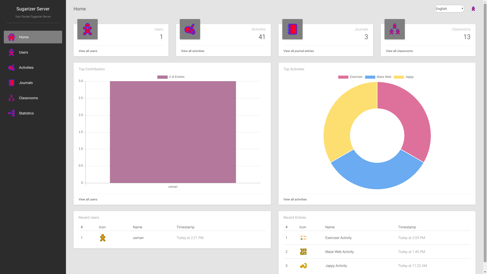

# Sugarizer Server

[Sugarizer](https://github.com/llaske/sugarizer) is the open source learning platform based on Sugar that began in the famous One Laptop Per Child project.

Sugarizer Server allows the deployment of Sugarizer on a local server, for example on a school server, so expose locally Sugarizer as a Web Application. Sugarizer Server can also be used to provide collaboration features for Sugarizer Application on the network. Sugarizer Server could be deployed in a Docker container or on any computer with Node.js 6+ and MongoDB 2.6+.

## Running Sugarizer Server

The easiest way to run Sugarizer is to use Docker. To do that, type command lines:

	git clone https://github.com/llaske/sugarizer
	git clone https://github.com/llaske/sugarizer-server
	cd sugarizer-server
	sh generate-docker-compose.sh
	docker-compose up -d

For other options to install Sugarizer on your computer, to install it on the cloud or on a RaspberryPI, see [here](docs/install.md).

## Global architecture

See [here](docs/architecture.md) for a global description of the Sugarizer Server architecture.

## Server settings

Sugarizer settings are load by default from file [env/sugarizer.ini](env/sugarizer.ini). You could change the name of this file by changing the value of environment variable ``NODE_ENV``. So if the ``NODE_ENV`` variable is set to ``production``, Sugarizer will try to load ``env/production.ini`` file.

Following is the typical content of Sugarizer Server settings file:

	[information]
	name = Sugarizer Server
	description = Your Sugarizer Server

	[web]
	port = 8080

	[security]
	min_password_size = 4
	max_age = 172800000
	https = false
	certificate_file = ../server.crt
	key_file = ../server.key
	strict_ssl = false
	no_signup_mode = false

	[client]
	path = ../sugarizer/

	[presence]
	port = 8039

	[database]
	server = localhost
	port = 27018
	name = sugarizer
	waitdb = 1

	[collections]
	users = users
	journal = journal
	stats = stats
	classrooms = classrooms
	charts = charts

	[statistics]
	active = true

	[log]
	level = 1

	[activities]
	activities_directory_name = activities
	template_directory_name = ActivityTemplate
	activity_info_path = activity/activity.info
	favorites = org.sugarlabs.GearsActivity,org.sugarlabs.MazeWebActivity,org.olpcfrance.PaintActivity,org.olpcfrance.TamTamMicro,org.olpcfrance.MemorizeActivity,org.olpg-france.physicsjs,org.sugarlabs.CalculateActivity,org.sugarlabs.TurtleBlocksJS,org.sugarlabs.Clock,org.olpcfrance.RecordActivity,org.olpcfrance.Abecedarium,org.olpcfrance.KAView,org.olpcfrance.FoodChain,org.olpc-france.labyrinthjs,org.olpcfrance.TankOp,org.sugarlabs.ChatPrototype,org.olpcfrance.Gridpaint,org.olpc-france.LOLActivity,org.sugarlabs.StopwatchActivity,org.sugarlabs.GTDActivity,org.sugarlabs.Markdown,org.laptop.WelcomeWebActivity

The **[information]** section is for describing your server. It could be useful for clients connected to the server.

The **[web]** section describes the settings of the node.js process. By default, the web server is on the port 8080.

The **[security]** section regroup security settings. `min_password_size` is the minimum number of characters for the password. `max_age` is the expiration time in milliseconds of a session with the client. At the expiration of the session, the client should reenter its password. Default time is 172800000 (48 hours). Parameters `https`, `certificate_file`, `key_file` and `strict_ssl` are explain above.
It `no_signup_mode` is true, account creation is allowed only by an administrator or a teacher (no direct sign-up allowed by a student).

The **[client]** indicate the place where is located Sugarizer Client. Sugarizer Client is need by the server.

The **[presence]** section describes the settings of the presence server. By default, a web socket is created on port 8039. You need to change this value if you want to use another port.

The **[database]** and **[collections]** sections are for MongoDB settings. You could update the server name (by default MongoDB run locally) and the server port. Names of the database and collections had no reason to be changed. The `waitdb` parameter allow you to force server to wait for the database.

The **[statistics]** section indicate if the server will log client usage.

The **[log]** section indicate how the server log access. If `level` value is greater than 0 or is not present, Sugarizer Server will log all access to the server on the command line.

The **[activities]** section describes information on where to find embedded activities. The favorites value list ids of activities that Web Application users will find by default on the home page. All values are self explained and had no reason to be changed.

## Dashboard

Sugarizer Server Dashboard is an admin tool for teachers and deployment administrator. This dashboard can be used to control and manage the work of learners and manage and analyze all activities on a Sugarizer Server. The Dashboard has following features:

* Users: how many users have been registered on the server, recent users, top users on the server, create/edit/remove a user.
* Journal: how many Journals and how many entries in Journal on the server, last Journal, and last entries, edit a journal (see/update/remove) entries.
* Activities: how many activities are available on the server, change activities visibility from Client, update order and way to appear in the favorite view.
* Classrooms: a way to organize users on the server side to handle them more easily.
* Graphic and request: display graphics and report on previous data.

To login to the Dashboard the first time, you will have to create an admin account using this command:

	sh add-admin.sh admin password http://127.0.0.1:8080/auth/signup

Note: For security reasons, the script should be launched from the local machine. On Docker, attach a new shell to the container and launch the script from this shell - in that case the port to use should be 80, not 8080.

Where **admin** is the login for the new admin account and **password** is the password.

Once the admin account is created, you could access Sugarizer Dashboard on http://127.0.0.1:8080/dashboard.

## Server API

To implement the above functionalities, the sugarizer backend exposes an API. The API routes look as follows:

#### INFORMATION ROUTE

        [GET]    /api/

#### ACTIVITIES ROUTES

        [GET]    /api/v1/activities/org.olpcfrance.Abecedarium
        [GET]    /api/v1/activities/org.olpcfrance.Abecedarium?fields=id,index,name,index
        [GET]    /api/v1/activities
        [GET]    /api/v1/activities?name=gears
        [GET]    /api/v1/activities?favorite=false&sort=-version
        [GET]    /api/v1/activities?favorite=true&fields=index,name&sort=+name
        [POST]   /api/v1/activities

#### USERS ROUTES

        [POST]   /auth/login
        [POST]   /auth/signup
        [GET]    /api/v1/users
        [GET]    /api/v1/users?name=tarun
        [GET]    /api/v1/users?language=fr&sort=+name
        [GET]    /api/v1/users?sort=+name&limit=5&offset=20
        [GET]    /api/v1/users/:id
        [POST]   /api/v1/users/
        [PUT]    /api/v1/users/
        [DELETE] /api/v1/users/:uid

#### JOURNAL ROUTES

        [GET]    /api/v1/journal/
        [GET]    /api/v1/journal/type=shared
        [GET]    /api/v1/journal/type=private
        [GET]    /api/v1/journal/:jid
        [GET]    /api/v1/journal/:jid?aid=:aid
        [GET]    /api/v1/journal/:jid?aid=:aid&uid=:uid
        [GET]    /api/v1/journal/:jid?aid=:aid&sort=-timestamp
        [GET]    /api/v1/journal/:jid?aid=:aid&sort=-timestamp&offset=15&limit=10
        [GET]    /api/v1/journal/:jid?aid=:aid&sort=-timestamp&fields=text,metadata
        [GET]    /api/v1/journal/:jid?aid=:aid&stime=712786812367
        [POST]   /api/v1/journal/:jid
        [PUT]    /api/v1/journal/:jid?oid=:oid
        [DELETE] /api/v1/journal/?type=full
        [DELETE] /api/v1/journal/?type=partial&oid=:oid
        [GET]    /api/v1/aggregate
        [GET]    /api/v1/aggregate?type=shared
        [GET]    /api/v1/aggregate?type=private

#### CLASSROOM ROUTES

        [GET]    /api/v1/classrooms/
        [GET]    /api/v1/classrooms/:id
        [POST]   /api/v1/classrooms/
        [PUT]    /api/v1/classrooms/:id
        [DELETE] /api/v1/classrooms/:id

#### CHARTS ROUTES

        [GET]    /api/v1/charts/
        [GET]    /api/v1/charts/:id
        [POST]   /api/v1/charts/
        [PUT]    /api/v1/charts/:id
        [PUT]    /api/v1/charts/reorder
        [DELETE] /api/v1/charts/:id

#### STATS ROUTES

        [GET]    /api/v1/stats
        [GET]    /api/v1/stats?user_id=:uid
        [GET]    /api/v1/stats?event_object=home_view
        [GET]    /api/v1/stats?user_id=:uid&sort=-timestamp
        [POST]   /api/v1/stats
        [DELETE] /api/v1/stats

A full documentation of the API is available in http://127.0.0.1:8080/docs.

To generate docs, run the following command in `terminal`.

	npm install -d
	npm install apidoc -g
	apidoc -i api/controller  -i dashboard/helper -o docs/www/

## Import/Delete users using a CSV file

Sugarizer Server comes with a script to import/delete a set of students, teachers, administrators and classrooms from a CSV file.

To launch it, run the command line:

    cd sugarizer-server
    export NODE_ENV=settings
    node scripts/seed_users.js filename.csv

Where `settings` is the name of the .ini file to use for settings (default is `sugarizer`). `filename.csv` is the CSV who contains items to create/delete. Here's an example of CSV file:

    name,type,language,stroke,fill,password,classroom
    Lionel,admin,fr,#BCCDFF,#FF8F00,aaaa,
    Nikhil,student,,,,,CM2

Note that the header line is needed.

The signification of each field is:

* `name` is the name of the account to create.
* `type` is the type of account. Should be `student`, `teacher`, `admin` or `delete`. If the type of set to `delete`, the user with that `name` will be deleted.
* `language` is the language for the account. If missing, the default is `en`.
* `stroke` is the stroke color for the account. If missing, it's generated randomly.
* `fill` is the fill color for the account. If missing, it's generated randomly.
* `password` is the password for the account. If missing, it's generated randomly.
* `classroom` is the classroom for the student. If a classroom with this name exists, the student is added to the classroom. If a classroom doesn't exist, the classroom is created first. If missing, the student is let without classroom.

At the end of the script, a new CSV file named `output.csv` is generated. The output file has the same format than the input field with three more fields:

* `status` is 1 if item created, 2 if item deleted, 0 if an error happened.
* `comment` is the detail of action done.
* `_id` is the ObjectId of the created account.

Here's an example of output file:

    status,comment,_id,name,type,language,stroke,fill,password,classroom
    1,,5d30162ced7ee117b842ad4a,Lionel,admin,fr,#BCCDFF,#FF8F00,aaaa,
    1,Given password was invalid (Generated random password).,5d30162ced7ee117b842ad57,Nikhil,student,en,#D1A3FF,#AC32FF,l0dU,CM2

Note: For security reason, the script should be launched from the local machine. On Docker, attach a new shell to the container and launch the script from this shell - in that case the port to use should be 80, not 8080.

## Running Server securely using SSL

Sugarizer Server could be run securely using SSL.
Few parameters in the **[security]** section of the setting file are dedicated to that.

* To run the server securely set `https` parameter to `true`.
* `certificate_file` and `key_file` are path to certificate and key file to sign requests.
* `strict_ssl` should be set to `false` if your certificate is a self-signed certificate or is a certificate not signed by a trusted authority.

## Unit testing

Sugarizer Server includes a set of unit tests on the API.
To run unit tests for Sugarizer Server launch:

    npm install -d
    npm test

Note that settings for unit testing are defined in [env/test.ini](env/test.ini).

# Optimize performance

If you want to optimize JavaScript performance, you could generate an optimized version of Sugarizer and Sugarizer-Server with [Grunt](http://gruntjs.com). This optimized version will minimize and reduce the size of the public resources.

First, ensure that Node.js and npm are installed on your machine. See [here](http://nodejs.org/) for more information.

The Gruntfile.js contains task settings to build an optimized version of Sugarizer and Sugarizer-Server. To do that, ensure first that Grunt is installed:

	npm install -g grunt-cli

Then navigate to Sugarizer directory install the specific component for Sugarizer by running:

	npm install

Then launch Grunt task to minify Sugarizer JavaScript files:

	grunt -v

After minification, the `build` directory will contain the optimized version of each file in the same directory as the initial one, so you could just copy files:

	cp -r build/* .

Then navigate to Sugarizer-Server directory install the specific component for Sugarizer-Server by running:

	npm install

Then launch Grunt task to minify Sugarizer-Server CSS, Image and JavaScript files:

	grunt -v

Similarly, after minification, you could copy files:

	cp -r build/* .

## License

This project is licensed under `Apache v2` License. See [LICENSE](LICENSE) for full license text.

