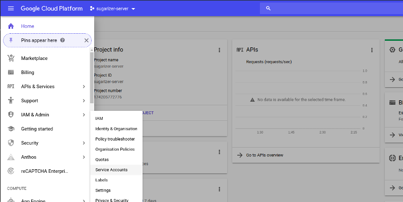
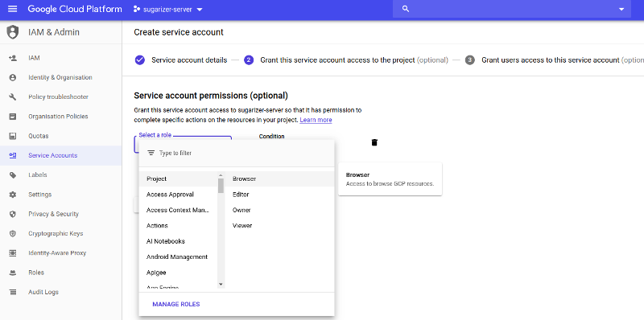
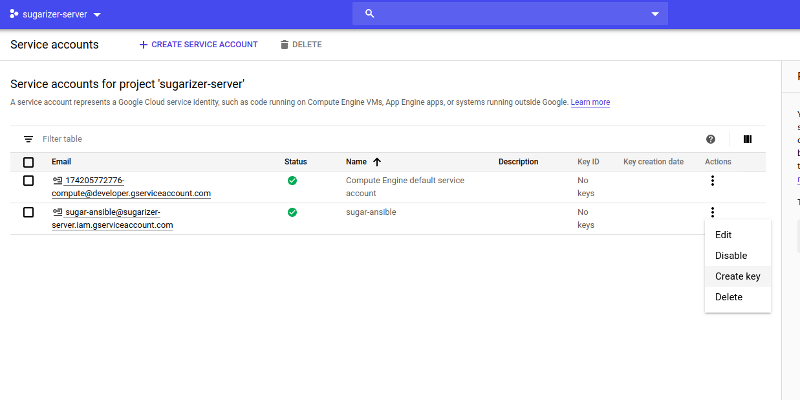

An alternative automated method for deploying Sugarizer Server using ansible is described in this file. Manual deployment method can be found [here](deploytoGCP.md)

Sugarizer server can be deployed easily on Google Cloud Platform(GCP) with ansible by following these steps:

**Step 1 -** Execute the following command, it will get the package (creates a deploy-to-gcp folder in current directory) and installs ansible if not already installed

Right click on this [link](../ansible/deploy-to-gcp/get-package.sh) and copy the link address then replace `github` with `raw.githubusercontent` and paste into the command below

    curl <Paste the copied link after required replacement here> -o - | sh

For example:

- if the copied link looks like this:

    `https://github.com/llaske/sugarizer-server/blob/dev/ansible/deploy-to-gcp/get-package.sh`
    
- then after replacement it will look like this:

    `https://raw.githubusercontent.com/llaske/sugarizer-server/blob/dev/ansible/deploy-to-gcp/get-package.sh`
    
- and the command to be executed will look like this:

    `curl https://raw.githubusercontent.com/llaske/sugarizer-server/blob/dev/ansible/deploy-to-gcp/get-package.sh -o - | sh`

    
**Step 2 -** Create a service account with project owner role and download the service account key file as json and move it inside deploy-to-gcp folder directory. Please follow instructions on creating a service account at the bottom if you are new to GCP.

**Step 3 -** Edit file `deploy-to-gcp/host-var/localhost.yml`

    # Enter name of service account key file
    credentials_file: 

    # Enter Project id
    project_id: 

    # Modify project zone
    zone: "us-central1-a"

    # Modify name of the instance
    instance_names: "sugarizer-server"

**Step 4 -** the execute this command

    ansible-playbook deploy-to-gcp/site.yml

On the terminal in the execution log `"ExternalIP = xx.xx.xx.xx"` can be seen if the external ip is 35.223.23.158 for example then the deployment could be accessed on 35.223.23.158:8080

**Creating service accounts**

Go to your project dashboard and note down the **project id**
Go the IAM & Admin and then into service account and click on create a new service account

Enter service account name and click on create, select Owner as role in next page, do not make modifications to third page and click on done.

Generate a key for the service account you have just created, select json as key type when prompted and download the json key file

