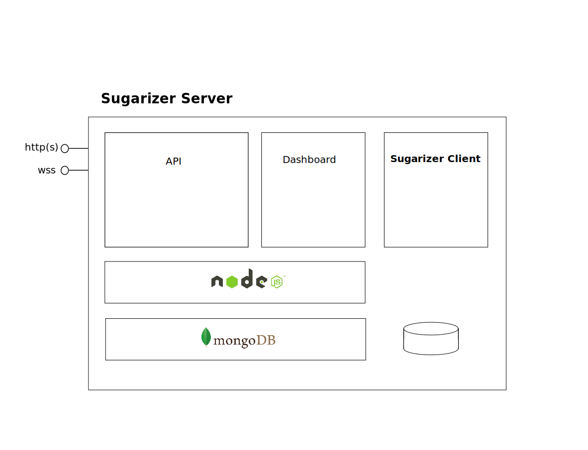

# Architecture

## Global overview 
Sugarizer Server is base on two components:

* [node.js](https://nodejs.org): the API and the dashboard is write in JavaScript on node.js. The dashboard use also the [EJS](https://ejs.co/) framework.
* [MongoDB](https://www.mongodb.com): all contents (users, journal, classrooms, ...) are stored in a MongoDB database.

The Sugarizer Server expose two access points on the network. A HTTP port for API/Dashboard and a WebSocket port for Presence. Sugarizer Server expose also Sugarizer Client to the network via the HTTP port so it should be include with Sugarizer Server.

The following schema sum up the architecture.

## Using into Docker

When used into Docker, two Docker containers are used:

* A docker container named **mongodb** for MongoDB database
* A docker container named **server** for node.js engine

None of this containers use data inside the docker, it's just running engines. All data are retrieved from the host via volumes linked to containers.

Here's the docker-compose file:

	version: "2"
	
	services:
	  mongodb:
	    build:
	      context: ./docker
	      dockerfile: Dockerfile-mongodb
	    restart: always
	    volumes:
	      - ./docker/db:/data/db
	    environment:
	      - AUTH=no
	
	  server:
	    build:
	      context: ./docker
	      dockerfile: Dockerfile-server
	    restart: always
	    volumes:
	      - ./:/sugarizer-server
	      - ../:/sugarizer-certificate
	      - ../sugarizer:/sugarizer-client
	    links:
	      - mongodb
	    ports:
	      - 8039:8039
	      - 8080:80

We could see 4 volumes:

* `/data/db` - linked to the `./docker/db` directory of the host - where all the database contents are stored
* `/sugarizer-client` - linked to the `../sugarizer` directory of the host - where node.js looks for Sugarizer code
* `/sugarizer-server` - linked to the `.` directory of the host - where node.js looks for Sugarizer Server code
* `/sugarizer-certificate` - linked to the `..` directory of the host - where Sugarizer Server looks for SSL certificate when need

The following schema sum up the architecture. Container limits and volumes names are in blue.

