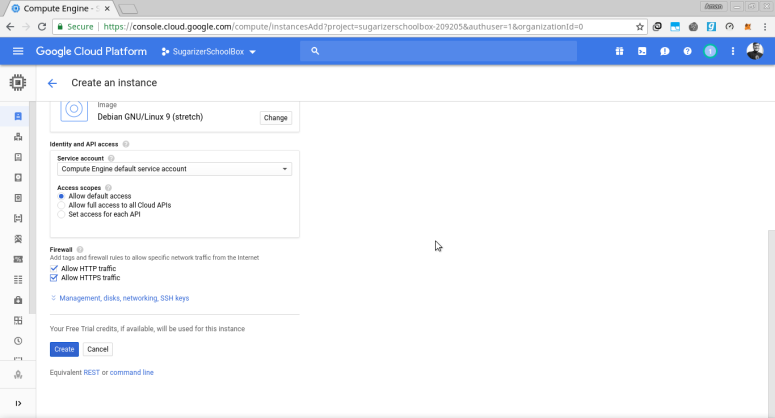
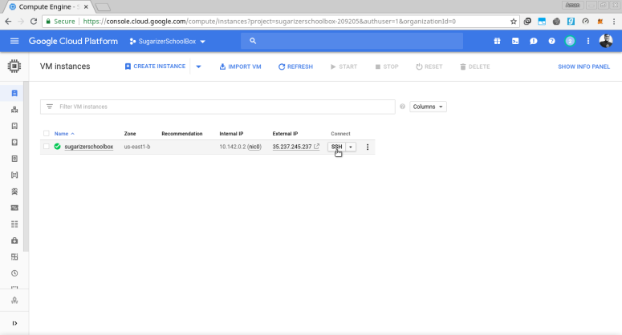

# Deploy Sugarizer on GCP

## Why GCP?

Google Cloud platform is an optimal choice right now because it provides 300$ free credits for an year , which could be beneficial in case of scaling up an app as the user increases.

## Steps to Deploy Sugarizer :

*Step 1:* Create a google account if you not have one and login into GCP.

*Step 2:* Click on Console button at the top , then click on “Select a Project”.

*Step 3:* Create New Project. Then select the created project.

*Step 4 :* Create new vm instance.

Enable billing for the VM. Create Instance and allow HTTP and HTTPS. You can choose the machine type as per the number of users.

*Step 5 :* SSH into the VM and past these command into the opened ssh window.

*Step 6 :* Ingress Firewall Rule.

To allow incoming http requests to our vm , we need to add a firewall rule. Click on 3 dashes in the top-left corner. Scroll down the list and  hover on “VPC network” and then click “Firewall rules”. click on “create firewall rule” and make settings same as the screenshots below.
