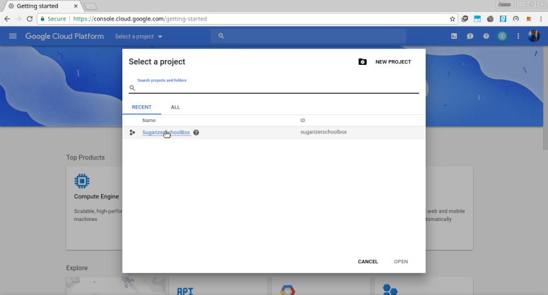
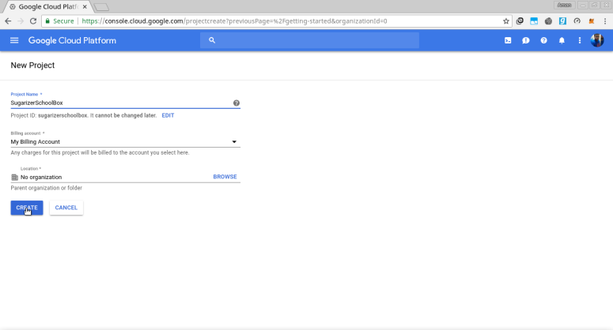
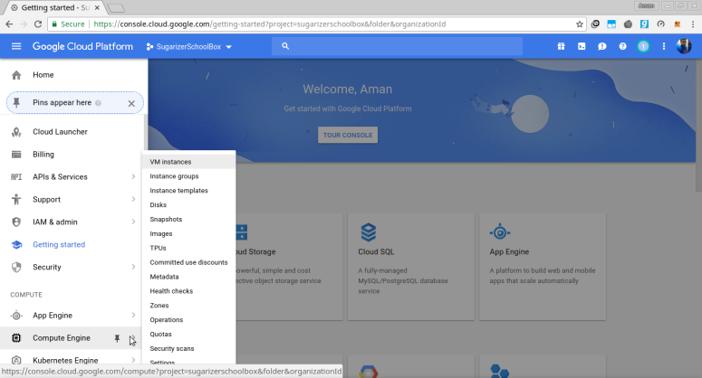
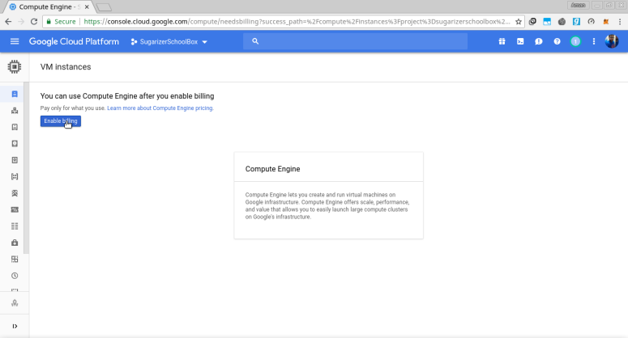
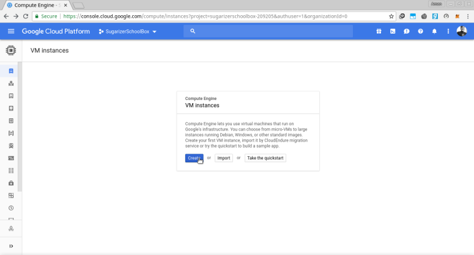
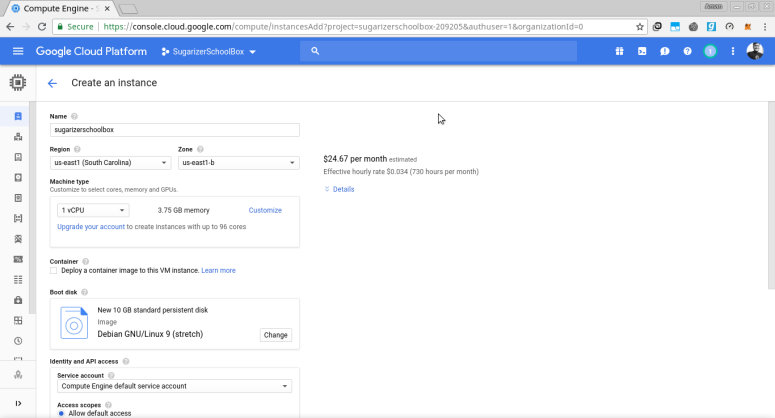
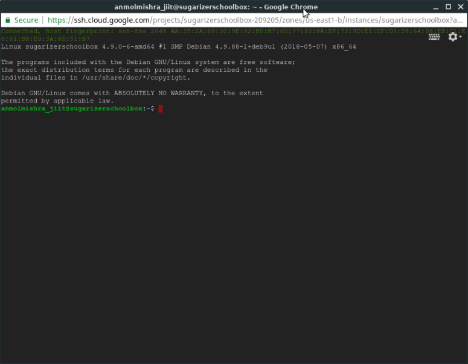
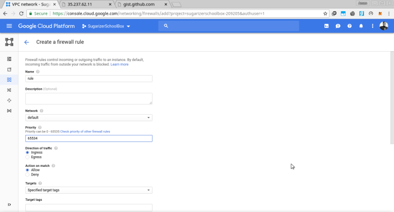

# Deploy Sugarizer Server on GCP

## Why Google Cloud Platform ?

Google Cloud platform is an optimal choice right now because it provides 300$ free credits for an year , which could be beneficial in case of scaling up an app as the user increases.

## Steps to Deploy Sugarizer :

*Step 1:* Create a google account if you not have one and login into GCP.

*Step 2:* Click on Console button at the top , then click on “Select a Project”.

*Step 3:* Create New Project. Then select the created project.

*Step 4 :* Create new vm instance.

Enable billing for the VM. Create Instance and allow HTTP and HTTPS. You can choose the machine type as per the number of users.

*Step 5 :* SSH into the VM and paste these command into the opened ssh window.

	sudo apt update
	sudo apt install -y git
	git clone https://github.com/llaske/sugarizer
	git clone https://github.com/llaske/sugarizer-server
	curl -fsSL https://get.docker.com/ | sh
	curl -L "https://github.com/docker/compose/releases/download/1.8.1/docker-compose-$(uname -s)-$(uname -m)" > ~/docker-compose
	chmod +x ~/docker-compose
	sudo mv ~/docker-compose /usr/local/bin/docker-compose
	cd sugarizer-server
	sh generate-docker-compose.sh
	sudo docker-compose up -d

*Step 6 :* Ingress Firewall Rule.

To allow incoming http requests to our vm , we need to add a firewall rule. Click on 3 dashes in the top-left corner. Scroll down the list and  hover on “VPC network” and then click “Firewall rules”. click on “create firewall rule” and make settings same as the screenshots below.

*Step 7 :* Copy the External IP of the vm (Suppose 35.227.60.150) , Sugarizer will be accessible at 35.227.60.150:8080.

